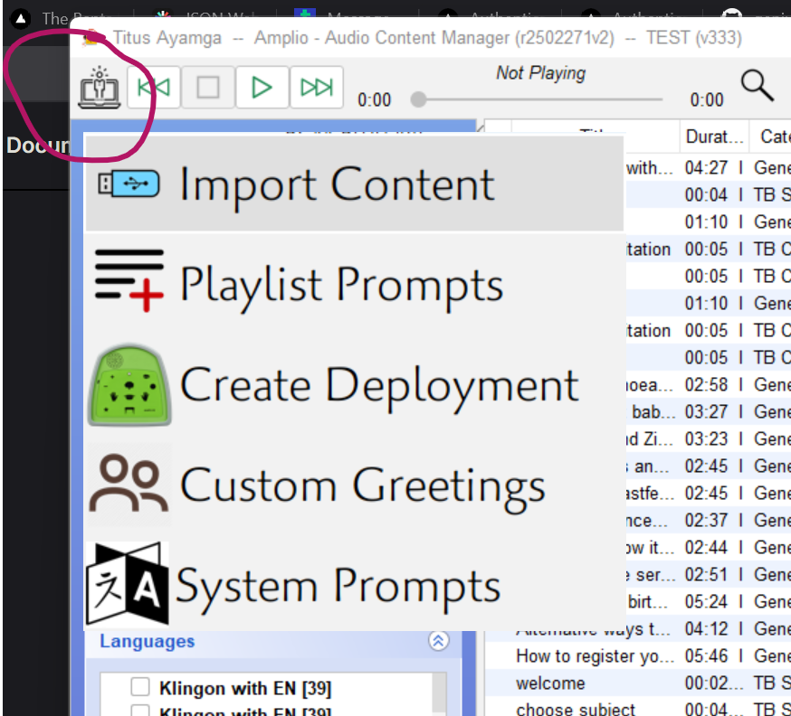

# ACM Setup Guide

## 1. SETUP

These are the steps to follow to set up the Amplio ACM:

- First, follow [this link](https://downloads.amplio.org/software/index.html) to download the latest version of the ACM.

        

- **Install the ACM:**  
  Just a simple installation process like any other `.exe` app. Install the ACM by running the installer.

## 2. LOGIN

Once the installation is successful, proceed to log in.  
---

Contact the Amplio tech team for your login details if you don’t have them.

---

- **Program Selection:**  
  Search through the available programs to select your program.  
  ---
  
  If you can't find your program in the ACM, contact the Amplio tech team.

- **Program Setup:**  
  no infor yet... please wait im thinking...

## 3. CONTENT IMPORT

- **Deployment and Language Selection:**  
  Look at the far-left corner; you will see an icon that looks like a computer (the drawer icon).  
    

    i. - **Choosing a deployment**
    - Deployment Assistant
    - Choose the deployment number you want to create and select the language
      
      
    
    ---
    ii. - **message → content matching**
     
     
     

    iii. audio file upload. upload the audio content from your local machine.

    

    iv.**content matching**

    - this is alligning the program content with the program specs

    

    v. finish
    

  
