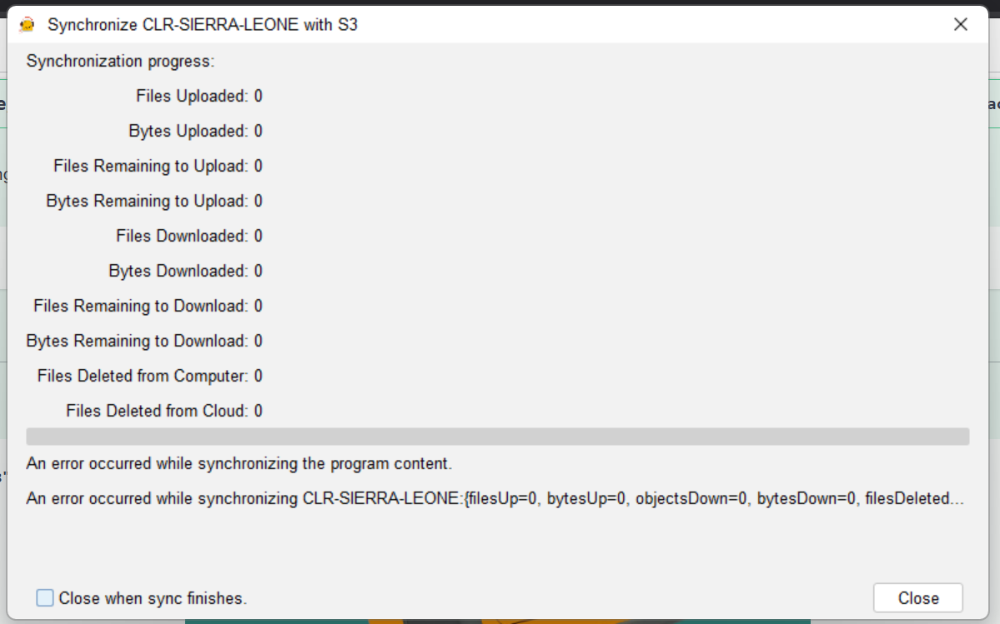

# Resolving ACM Synchronization Error ⚠️

**Error Message:**  
*"An error occurred while synchronizing the program content."*

This error typically appears when the software fails to connect with the amplio server during startup. Follow these steps to resolve it:

---

## Step 1: Check Your Network Connection
1. Ensure you're connected to the internet
2. Try accessing other websites/services to confirm
3. If using VPN/corporate network:
   - Disconnect and reconnect
   - Contact IT if the issue persists

---

## Step 2: Restart 
1. Completely close your PC and the ACM software
2. Wait 30 seconds
3. Relaunch your PC and the ACM Software 

---
